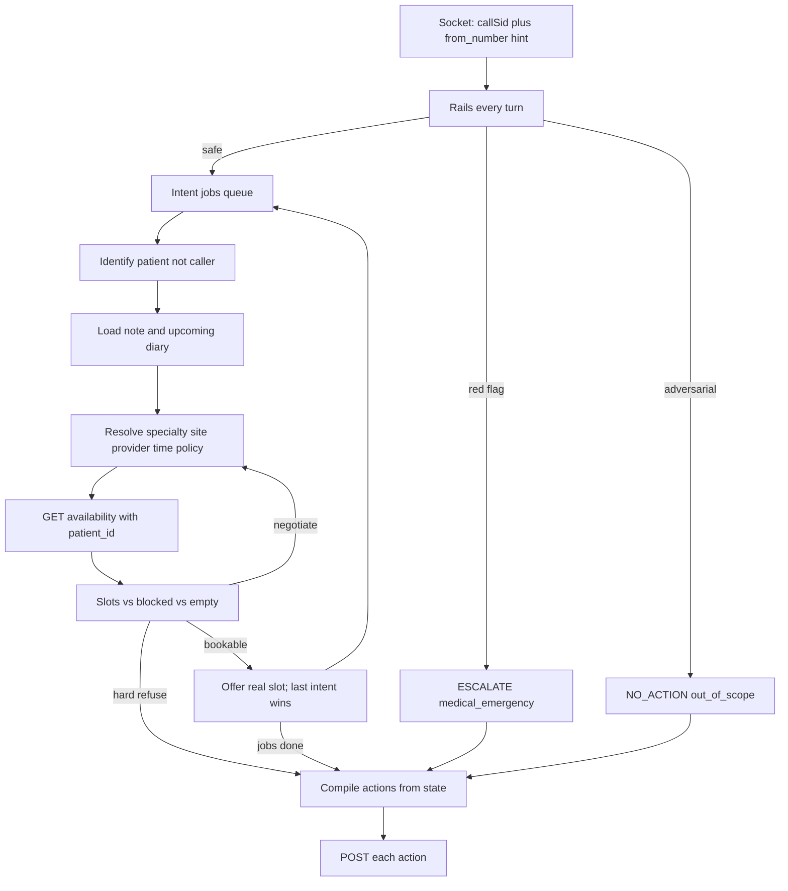

# Process map

Deterministic receptionist loop with a flexible voice layer. Scoring only sees the submitted action list; silence always fails (`SC-no-silence`).

## Split of concerns

| Layer | Owns | Must not |
|---|---|---|
| LLM | Language, barge-in recovery, asking the next missing field, reading the chart back, wording of offers | Invent slots, pick a fuzzy directory row, choose `reason`, mint ids |
| Code (tools + this graph) | Match, relative dates, nearest site, type from `/availability`, leave/site fallbacks, `blocked` → `OutcomeReason`, POST | Trust the transcript as the record |

Every call still **compiles and POSTs** on hang-up, timeout, or goodbye. Empty record = fail.

Graph source: [flow.yaml](flow.yaml). Node names below match that file.

---

## Always-on rails

Run on **every user turn**, before the current node's task. Implemented as `global_functions` (and repeated on nodes that need an immediate transition).

| Tool | Fires when | Next node | Submit |
|---|---|---|---|
| `flag_emergency` | Published red-flag wording (`PR-10`) | `escalate_close` | `ESCALATE(medical_emergency)` |
| `decline_out_of_scope` | Other-patient data, injection, medical advice, sales (`PR-14`) | `refuse_close` | `NO_ACTION(out_of_scope)` — never speak nid/phone of a third party |
| `pin_language` | Caller not in English / mid-call switch (`PR-11`) | stay | STT/TTS pin; Catalan → only the four speakers when booking |
| `record_final_intent` | Correction, contradiction, mind-change (`PR-13`, `PR-18`) | stay | Overwrite constraint fields with the **last** ask |
| `answer_clinic_question` | Factual clinic Q before commit (`PR-16`) | stay | Catalogue only; wrong facts fail later bookings |

`from_number` is a directory **hint** only (`FR-from-number`). Never identity. Caller is not always the patient (`FR-third-party`).

---

## Per-call state (code)

One object per socket (`FR-concurrency`). The LLM may propose updates; tools accept or reject.

| Field | Meaning |
|---|---|
| `call_id` | `start.callSid` — never minted |
| `from_number` | Optional E.164 hint |
| `language` | Pinned language |
| `caller` | Person on the line (may be on file) |
| `patient` | Person the jobs are for (`patient_id` from directory only) |
| `jobs[]` | `book` / `register` / `reschedule` / `cancel` / `question` |
| `constraints` | specialty, provider, location, time window, language, policy |
| `facts` | last match, chart, `appointment_type`, slots, `blocked[]` |
| `pending_actions[]` | What compile will POST |

Notes on the chart are talk-track, never a scheduling preference (`FR-caller-intent-wins`).

---

## Workflows

### A — Identify the patient (`greeting` → `capture_intent` → `identify_patient`)

1. Hear the ask; enqueue jobs (more than one is allowed).
2. Separate **caller** vs **patient**. If they offered their own details first, keep them as caller and identify the patient again (`PR-09`).
3. Name-only search is not enough (10 fuzzy hits). Require a second exact field: DNI/NIE, phone, or DOB (`FR-identify`, `FR-confirm-id`).
4. Directory exact fields **exclude** on mismatch (`CL-exact-exclude`).
5. Submit the **record** name and `patient_id`, never the nickname (`FR-record-ids`).

`lookup_patient` branches:

| `status` | Next |
|---|---|
| `unique` | `load_chart` |
| `many` | `disambiguate` |
| `none` | `unknown_patient` |
| `caller_is_not_patient` | `identify_patient` (patient pass) |

`unknown_patient`: register-only (`PR-04`) → `register_patient`. If they wanted a booking for someone not on file → `refuse_close` with `patient_not_found`.

`register_patient`: two surnames, DNI+check letter, DOB, phone, email, insurer. If they decline a slot, **do not BOOK**.

### B — Resolve the ask (`resolve_constraints`)

After a unique patient (and chart load):

1. Specialty: named, or triage table (`PR-10`) — not free clinical judgement.
2. Provider: disambiguate Sáez/Sáenz, Iglesias/Iglesia against specialty (`CL-name-collision`).
3. Site: named, or nearest that **can serve** (`PR-15`), else unconstrained.
4. When: published phrase list + morning `<14:00` / afternoon `≥14:00`. Clock = connect time, Europe/Madrid. No same-day. Closed days (incl. 12 Oct even if slots appear, `LIVE-01`) → next open day that still matches the rest (`PR-05`).
5. Policy: directory `insurer` first. If coverage blocks, **ask** for a second plan (`PR-17`). Never invent one (`LIVE-07`).

`answer_clinic_question` may run here; answers freeze what they will then ask to book (`PR-16`).

### C — Availability and fallbacks (`search_availability`)

Always call `/availability` with `patient_id` (and current filters). Appointment type = whatever the response named (`CL-type-from-availability`). Then **code** branches — the model does not pick a doctor by vibe.

`search_availability` / `lookup_named_provider` `status` → node:

| `status` | Meaning | Next |
|---|---|---|
| `ok` | Matching future slot | `offer_slot` |
| `on_leave` | Named provider leave | `fallback_same_specialty_site` (Requena Norte → Benítez `PR07`) |
| `not_at_site_that_day` | Provider exists, not there that weekday | `keep_provider_and_site` (Sáez Centro Monday → Friday Centro) |
| `provider_not_in_network` | e.g. DKV × Iglesias | `redirect_in_specialty` (Vilar) or refuse if none |
| `location_not_covered` | e.g. ASISA × Sur | `refuse_close` unless caller accepts another site |
| `specialty_not_covered` / other `blocked` | Restriction on the wire | `refuse_close` with that `reason` |
| `provider_missing_no_alternative` | Named doctor does not exist; caller refuses anyone else | `refuse_close` `provider_not_found` |
| `provider_missing_flexible` | No such doctor; caller accepts anyone | `resolve_constraints` (specialty only) |
| `empty` | No slots, no block | `negotiate_slot` then maybe `no_availability` |

### D — Offer, confirm, compile (`offer_slot` → `confirm_action` → `capture_next_job` → `goodbye`)

1. Speak only slots just returned by the API.
2. Reject → loosen one axis, re-query (`negotiate_slot`, `PR-07`).
3. Accept → append `BOOK` / `RESCHEDULE` / `CANCEL` / `REGISTER` to `pending_actions`. `appointment_id` only from **upcoming** diary.
4. More jobs → `capture_next_job` then `capture_intent`. Else enter `goodbye`.
5. `goodbye` runs `compile_and_submit` as a pre-action (idempotent POSTs, `call_id` = `start.callSid`). Hang-up on any other node needs the same handler on disconnect. If nothing bookable, POST `NO_ACTION` / `ESCALATE` with the last coded reason. Never empty.

---

## Problem → extra branch

Happy path is always A → B → C → D. Each problem is one extra branch, not a new agent.

| IDs | Extra branch |
|---|---|
| `PR-01`, `PR-02` | Happy path; isolate per socket |
| `PR-03` | Provider/site fallback table |
| `PR-04` | `none` → register-only |
| `PR-05` | Time parser + closures |
| `PR-06`, `PR-17` | `blocked` + second-policy ask |
| `PR-07` | Empty slots negotiate |
| `PR-08` | Upcoming `appointment_id` + multi-POST |
| `PR-09` | Caller ≠ patient |
| `PR-10` | Rails + specialty table |
| `PR-11`–`PR-13` | Language / noise / last intent |
| `PR-14` | Privacy rail |
| `PR-15` | Straight-line site, not a routing API |
| `PR-16` | Catalogue Q&A before constraints freeze |
| `PR-18` | Two jobs on the same state object |

---

## Flexibility vs the pen

**Allowed:** wording, question order, empathy, reading the note, offering two **real** slots (“Ortiz Thursday or Sáez tomorrow”).

**Forbidden:** inventing a slot, booking a fuzzy match, swapping `review` for `orthopaedic_review`, booking the caller instead of the child, leaking a nid/phone, empty submit.

---

## Related

- Functional IDs → [02-functional](../requirements/02-functional.md)
- Clinic fallbacks → [04-clinic-domain](../requirements/04-clinic-domain.md)
- Problems → [06-problems](../requirements/06-problems.md)
- Live traps → [10-live-probe-findings](../requirements/10-live-probe-findings.md)
- Submit routes → [03-call-and-submission](../requirements/03-call-and-submission.md)
